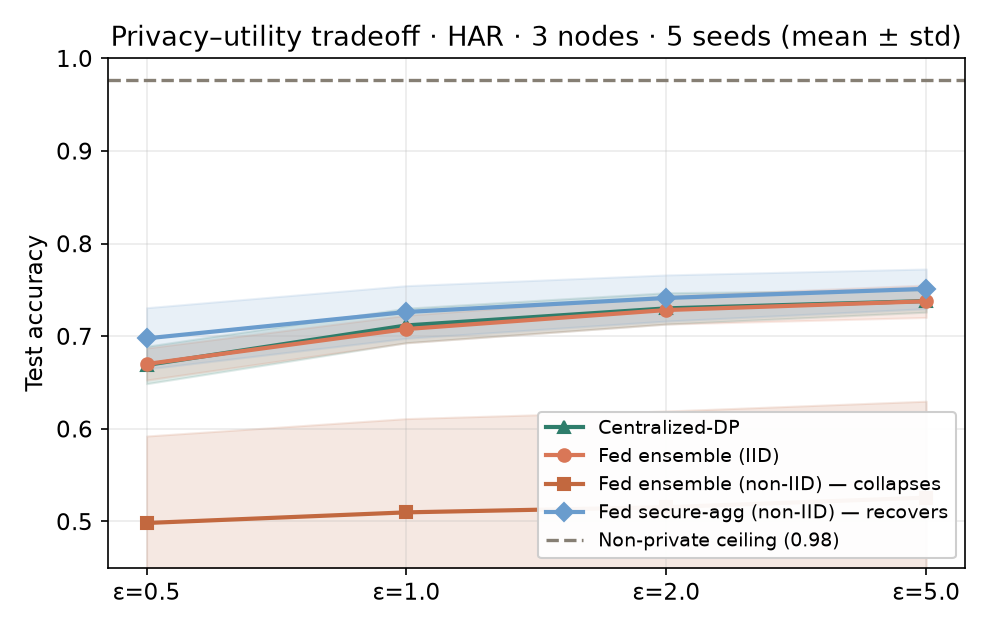

# GBA-DF Federated Learning POC — multi-modal (eye-gaze · action · EEG/fMRI)

A **working** federated-learning proof-of-concept for the Greater Bay Area Data Federation.
It demonstrates, end-to-end and recordable, the four claims the federation rests on — across
**three data modalities** (eye-tracking, body-action/pose, EEG/fMRI), with a **desktop node
client** a partner runs on their own machine (pick modality → pick folder → connect):

## AI4ASD program context

> **Part of the [AI4ASD research program](https://github.com/HKUST-FintechLab/AI4ASD).**
> This repository is the privacy-preserving federation execution layer: partner
> data stays local while approved aggregate computations produce auditable joint
> results. Its companion AI4MATH repository studies the exact mathematical
> certificates intended to make policy, privacy, and correctness independently
> checkable.

### Related repositories

| Repository | Relationship to AI4ASD |
|---|---|
| [AI4ASD](https://github.com/HKUST-FintechLab/AI4ASD) | Umbrella program and integrated architecture across perception, agents, evidence, privacy, validation, and governance. |
| [asd_super_agent](https://github.com/HKUST-FintechLab/asd_super_agent) | Evidence-grounded multi-school intervention agent and user-facing workflow. |
| [asd_ai_ceo](https://github.com/HKUST-FintechLab/asd_ai_ceo) | Translational research workspace connecting multimodal screening, the agent system, research artifacts, and clinical/ethics validation. |
| **GBA-DF-data-share (this repository)** | Privacy execution plane: local feature extraction, secure aggregation, differential privacy, and signed audit. |
| [GBA-DF-data-share-AI4MATH](https://github.com/HKUST-FintechLab/GBA-DF-data-share-AI4MATH) | Companion proof plane for exact, machine-checkable policy and correctness certificates. |

| Claim | How it's shown | Honest scope |
|---|---|---|
| **Multi-node** | Coordinator + N independent node processes (each can run on a different machine). | Fully supported. |
| **DP + secure aggregation** | Every node uploads **pairwise-masked** integer leaf counts of a **shared, data-independent** forest. The coordinator can only recover the **pooled sum** (masks cancel) — never an individual node's counts — then adds **Laplace(1/ε)** to that secure aggregate (central DP on the sum) and meters a **global ε-budget**. | Genuine **(ε,0)-DP** on the aggregate, **basic composition**, ε **coordinator-enforced**. The coordinator never sees individual node data. Caveats: honest-but-curious, **non-colluding** coordinator; **full cohort required per round** (no Shamir dropout recovery — future work). |
| **Signed + hash-chained audit** | Each node update is **Ed25519-signed** (binds round, n_samples, masked payload); each event is signed by the coordinator and **hash-chained**. `verify()` checks the chain **and** every signature against the coordinator's published key (`/pubkey`). | Detects any edit / truncation / re-sign-with-wrong-key within a run (`verify_security.py`). A *fully compromised* coordinator needs external anchoring (future work). |
| **Federated ≈ centralized-DP, robust to non-IID** | Multi-seed benchmark (`bench.py`) vs centralized-DP + the non-private ceiling, IID **and** non-IID. | Secure-agg tracks centralized-DP and **recovers the non-IID collapse**: the naive per-node ensemble drops to **0.51±0.10** under label skew; secure-agg holds **0.73±0.03** (figure below). |

Verified run (HAR, 3 nodes × 5 rounds, **ε=1/round**): federated **secure-agg DP ≈ 0.80 ≈ centralized-DP
0.72** vs **non-private ceiling 0.972** (the DP utility cost); coordinator sees only masked sums, global
ε metered (5.0/10), under-budget/`429` enforced, audit **chain + signatures verified**.
`verify_security.py` runs **25 checks**. Hardened across **four rounds** of adversarial code audit
(security · regressions · DP correctness · secure aggregation).

Each modality is its **own federation** (its own feature schema); the privacy machinery is identical —
only the front end that turns raw recordings into features changes. Verified live end-to-end on all three
(3 nodes × 4 rounds, ε=1/round): eye-gaze fed AUC **0.78**, action **~0.80**, EEG/fMRI **0.80**, each
≈ its centralized-DP reference and below its non-private ceiling.



*The privacy dial (HAR, 3 nodes, 5 seeds). Non-private ceiling ≈ 0.98 → DP ≈ 0.73 is the honest cost of
the ε-guarantee. Under non-IID label skew the naive per-node ensemble **collapses** (~0.51) while secure
aggregation **holds** (~0.73), tracking the centralized-DP reference. Regenerate with `uv run python bench.py`.*

## Method — DP federated forest

**Secure aggregation + central differential privacy** (a strategy that fits tree / random-forest models
whose leaves are class histograms):

- **Shared, data-independent forest** — all nodes build the *same* trees from a **public** structure
  seed; splits are random features + thresholds from **public** per-feature bounds (HAR is documented-
  normalised to [-1,1]; each modality is mapped into the same public [-1,1] range by a shipped public
  `tanh(raw/scale)` transform). Private data never influences tree shape (`verify_security.py` proves this).
- **Node** — routes its local data to leaves (each record → one tree ⇒ L1 sensitivity 1), then masks
  its integer count vector with **pairwise X25519 masks** (`secure_agg.mask_counts`) and uploads only
  the masked vector.
- **Coordinator** — sums the masked vectors; the masks cancel, so it recovers **only the pooled leaf
  counts** (never an individual node's), then adds **Laplace(1/ε)** to that sum (`dp.forest_from_summed_counts`)
  and meters a **global ε-budget**. Disjoint records ⇒ *parallel* composition within a round; rounds
  compose sequentially (basic composition).
- Because the secure sum is the pooled distribution, the result tracks **centralized-DP even under
  non-IID** — fixing the per-node-ensemble collapse.

The non-private ceiling (label-optimised ExtraTrees) and a centralized-DP reference are computed in
`prepare_data.py`; `bench.py` produces the multi-seed IID/non-IID comparison and the ε-utility figure
above (`assets/epsilon_utility.png`, regenerated at `data/epsilon_utility.png`).
The legacy per-node-ensemble path (`dp.build_dp_counts`/`add_dp_noise`) is retained for that benchmark.

## Modalities (`modalities.py`) and benchmark datasets

**Modalities** — each turns a partner's folder of *raw recordings* into a fixed-width feature vector via
its own front end, then feeds the identical federation. `demo_dataset()` synthesizes a realistic cohort so
every modality runs end-to-end through the **same** extractor a real folder would:

| Modality | Raw files a partner has | Features → task | Dim |
|---|---|---|---|
| **`eyegaze`** | one gaze CSV per recording (`x, y[, pupil]`), under `asd/` `td/` | fixation / saccade / spatial-attention summary → ASD/TD | 32 |
| **`action`** | raw video converted locally by the desktop client, or one MediaPipe-pose `.npz` (key `body`, `(T,33,4)`) per clip | kinematic pose features (`features.py`) → ASD/TD | 174 |
| **`neuro`** | one EEG/fMRI `.npz` (key `ts`, channels×time) or CSV per scan | spectral band-power + functional-connectivity summary → ASD/TD | 48 |

Features are squashed into the **public** `[-1,1]` DP range by `tanh(raw / scale)`, where `scale` is a
**shipped public constant** (`public_scales.json`) computed once from a fixed-seed synthetic *reference*
cohort — **never** from participant data (`verify_security.py` proves it stays public and participant-
independent). `tanh` is monotone, so tree accuracy is unchanged while the DP forest gets a genuinely
public range to draw thresholds from.

**Benchmark datasets** (for the strong-signal numbers, no modality front end):

- **`har`** (default) — UCI Human Activity Recognition (6 activities, 561 features, 10,299 windows;
  fetched once via OpenML, cached to `data/`). Real action data, strong signal, the canonical FL benchmark.
- **`pose`** — an optional loader for MediaPipe-pose `.npz` seed data with a subject-level split. The
  seed data is **not shipped** with this repo; supply your own (see `data_loaders.load_pose`) or just use
  `har` / the `action` modality. `load_pose()` raises a clear error if the seed data is absent.

## Quick start (uv)

This project uses [uv](https://docs.astral.sh/uv/) (`pyproject.toml` + `uv.lock`).

```bash
git clone https://github.com/HKUST-FintechLab/GBA-DF-data-share.git
cd GBA-DF-data-share
uv sync                                   # creates .venv from pyproject.toml / uv.lock
uv run python verify_security.py          # 25 checks (tamper-evidence, sig binding, schema/bounds, DP, secure-agg, modality)
uv run python modalities.py               # optional: self-check all three feature extractors

# one command: prepare data -> start coordinator -> run all nodes -> live dashboard
uv run python run_demo.py --nodes 3 --rounds 5                 # HAR benchmark
uv run python run_demo.py --modality eyegaze --prepare         # eye-tracking federation
uv run python run_demo.py --modality neuro --noniid --prepare  # EEG/fMRI, skewed cohort
# open the dashboard URL it prints (http://localhost:8055), then start your screen recorder
```

> The first run creates two **git-ignored working directories**: `data/` (the fetched HAR cache, the
> coordinator's held-out test set, per-node partitions, and any figures `bench.py` writes) and `nodes/`
> (each node's local data + its `0600` private signing key). Nothing in them is committed.

Re-prepare / change dataset or modality:

```bash
uv run python prepare_data.py --modality eyegaze --nodes 3     # eye-tracking (synth demo cohort)
uv run python prepare_data.py --modality action  --nodes 3     # body-pose action
uv run python prepare_data.py --modality neuro   --nodes 3     # EEG/fMRI
uv run python prepare_data.py --dataset  har     --nodes 3 --total-trees 600   # benchmark
uv run python run_demo.py --prepare --modality eyegaze --nodes 3 --rounds 5
```

## Desktop node client (partner side, pywebview)

A partner runs a small desktop app instead of the CLI: **pick a data modality → choose or prepare local
data → enter node + coordinator info → connect**, with a live, recordable progress view. Same code path
as `node.py` (both call `node_core.py`) — raw data never leaves the machine.

```bash
uv sync --extra client                    # adds pywebview (WebKit/macOS, WebView2/Windows, GTK/Linux)
uv run python client_app.py               # opens the window
uv run python client_app.py --selftest    # headless API smoke test (no GUI)
```

No data of your own? The client's **"Generate a demo folder"** button writes a synthetic cohort (clearly
labelled) in the right format so a partner can walk the whole flow before wiring up real recordings.

For the **action** modality, step 2 has two inputs:

- **Choose NPZ folder** — use existing `body: (T,33,4)` files under `asd/` and `td/` as before.
- **Extract raw video** — choose one or more local videos, assign the batch to ASD or TD, and select a
  2/4/8 fps sampling rate. The web view loads the pinned MediaPipe Holistic JavaScript package from
  jsDelivr only when requested, decodes every video locally, and shows the video with a live 33-point
  skeleton overlay and extraction progress. The browser sends only the extracted landmark array to the
  local Python bridge; the existing NumPy dependency atomically writes a compressed compatible NPZ into
  the selected dataset folder. The app then scans that folder and continues through the unchanged
  feature-extraction and federation path.

The CDN receives normal library/model requests but never receives the selected video or its landmarks.
Raw-video conversion therefore needs network access the first time MediaPipe assets are loaded; direct
NPZ input remains available without that step. Python MediaPipe is not required.

To join a hosted federation, you only run the **desktop client** — no server to stand up. Ask whoever
runs the coordinator for its **URL** and the **password**, enter both on the *Node & coordinator* step
(the built-in **Test connection** confirms them), and go. Raw data never leaves your machine either way.

### Access control (password) & cohort mode

The coordinator reads two environment variables at startup — set them when you host it:

```bash
# require a shared password + run as a per-guest "solo" federation
FED_PASSWORD=<your-password> FED_COHORT=1 \
    uv run uvicorn coordinator:app --host 0.0.0.0 --port <port>

# same password, real 3-node secure-aggregation federation
FED_PASSWORD=<your-password> FED_COHORT=3 \
    uv run uvicorn coordinator:app --host 0.0.0.0 --port <port>
```

| Variable | Effect |
|---|---|
| `FED_PASSWORD` | If set, every **contribute-path** call (`/schema`, `/register`, `/participants`, `/submit`, `/round`) must carry header `X-Fed-Key: <password>`. The desktop client sends it from its **Password** field; the CLI uses `--password`. Unset = open (local dev only). Read-only paths (`/status`, `/audit`, `/model`) stay open so the dashboard and consumer path keep working. |
| `FED_COHORT` | Overrides the cohort in `meta.json`. **`FED_COHORT=1`** turns on **per-guest isolation**: each client (keyed by a private session id) gets its *own* cohort-1 federation, so independent testers never collide or see each other's model — connect **alone, anytime** (privacy = central DP, no masking with one node). **`FED_COHORT=3`** is a real **secure-aggregation** run: **3 clients must be connected together**; masks cancel so the coordinator only recovers the pooled sum, never any node's own counts. |

Share the password out-of-band — it gates who may contribute data to the federation.

## Run a node on another machine (partner group)

The federation is just a coordinator + clients over HTTP, so a partner runs a node on their own
hardware against their own data:

```bash
# on the coordinator host
uv run uvicorn coordinator:app --host 0.0.0.0 --port 8055

# on the partner's machine (their data stays on their machine)
uv run python node.py --node-id partner_lab --coord http://<coordinator-host>:8055 \
    --data /path/to/their/local/data.npz --rounds 5 --trees 40 --name "University Lab"
```

`data.npz` holds their local `X` (features) and `y` (labels). Their private signing key is generated
next to it (`node_key.pem`) and **never leaves the machine**.

## Using the trained model (as a data-user / central node)

The model everyone trained together lives in the coordinator as an aggregated, pickle-free JSON forest
(a weighted ensemble of the per-round secure-aggregated DP forests). Two ways to consume it:

```bash
# (A) LOCAL inference — download the model once, score your OWN recordings offline so your
#     query data also stays on your machine (symmetric with training):
uv run python predict.py --coord http://<host>:8062 --folder my_new_cases --out predictions.csv

# (B) HOSTED inference — send feature rows to the coordinator's /predict (convenience):
uv run python predict.py --coord http://<host>:8062 --folder my_new_cases --hosted --out predictions.csv

# just archive the model artifact (JSON, with provenance) for offline / audit use:
uv run python predict.py --coord http://<host>:8062 --save-model global_model.json
```

`predict.py` prints a per-recording ASD/TD call + confidence, and (if your folder is labelled) the
accuracy. The endpoints are:

- **`GET /model`** — the aggregated model + provenance (modality, feature schema, rounds, DP ε spent
  vs budget, held-out test metric, the **audit tip** you can verify against `/pubkey`, and the
  coordinator's public key). Pickle-free JSON — safe to archive and re-load.
- **`POST /predict`** — `{"X": [[…]]}` in the published feature order → `{proba, pred}`. Prefer `GET
  /model` + local inference when the query data is itself sensitive.

Verified live (action modality, 5 rounds, ε=1/round): downloaded a 100-tree model (held-out AUC 0.805),
scored 10 unseen recordings locally at **9/10 correct**; the hosted path returns identical predictions.

## Files

| File | Role |
|---|---|
| `modalities.py` | **modality registry** — eyegaze / action / neuro: raw-folder feature extractors + synthetic demo generators + public normalization |
| `public_scales.json` | shipped **public** per-feature normalization constants (from a fixed-seed reference cohort, not participant data) |
| `data_loaders.py` | `har` / `pose` benchmark dataset loaders |
| `features.py` | pose-window → engineered feature vector (for `action` / `pose`) |
| `prepare_data.py` | split off coordinator test set, partition train across nodes, train centralized baseline (`--modality` or `--dataset`) |
| `fed_common.py` | Ed25519 signing, signature-verified hash-chained `Audit`, multiclass `GlobalModel` (forest merge) |
| `dp.py` | DP random forest: data-independent splits, leaf counts, shared-forest + curator noise |
| `secure_agg.py` | pairwise X25519 masking — coordinator recovers only the summed counts |
| `bench.py` | multi-seed IID/non-IID benchmark + the ε-utility figure (`assets/epsilon_utility.png`) |
| `coordinator.py` | FastAPI server: register / verify-signature / secure-sum / evaluate / audit / dashboard (publishes modality in `/schema`) |
| `node_core.py` | **shared node loop** used by both the CLI and the desktop client (extract locally, mask, submit, poll) |
| `node.py` | CLI node: `--data` baked features **or** `--folder`+`--modality` raw-folder ingestion |
| `client_app.py` | **desktop node client** (pywebview): pick modality → folder picker → node info → connect, live progress |
| `static/client.html` | the client's bilingual (中/EN) 4-step wizard UI (warm cream palette) |
| `predict.py` | **data-user / central-node client** — download the global model (`GET /model`) and score local recordings offline, or via `POST /predict` |
| `run_demo.py` | one-command recordable demo (`--modality`, `--noniid`) |
| `verify_security.py` | reproducible audit-tamper / signature-binding / payload-schema / DP / secure-agg / modality checks |
| `static/dashboard.html` | live coordinator dashboard (warm cream palette): accuracy, nodes, signed audit log |
| `DEMO_SCRIPT.md` | recording guide + narration for internal / partner demos |
| `PARTNER_GUIDE.md` | **cross-group experiment guide for a partner institution** (deploy, prepare data, run a node) |

## Security (hardened after an adversarial code audit)

- **No pickle on the wire.** Updates are a constrained JSON tree schema (`children_left/right,
  feature, threshold, leaf-proba`), validated and rebuilt into a pure-numpy predictor server-side —
  closing the `pickle.loads` RCE. Off-schema or raw-array payloads are rejected.
- **Signatures bind the payload.** The node signs `node_id | round | n_samples | sha256(masked)`, so
  nothing can be altered in transit. The merge weight is the `n_samples` the node **declared at
  enrolment** (signature-bound, but not independently verified — see honesty notes).
- **Secure aggregation + global ε-budget:** nodes upload only pairwise-masked counts; the coordinator
  recovers just the pooled sum (masks cancel), adds the DP noise itself, meters a **global** ε budget,
  and rejects (`429`) once exhausted. ε is coordinator-set, never node-declared.
- **Cohort integrity:** enrolment is **capped at the cohort size** (extra nodes → `409`) and a round
  aggregates only when the **exact enrolled set** has submitted — otherwise residual masks would
  silently corrupt the sum. A startup warning fires if **cohort < 3** (masking needs ≥3 to be meaningful).
- **Replay protection** (round must increase) and **TOFU enrolment** (`node_id` can't be rebound to a
  new key). Coordinator binds **127.0.0.1 by default** — expose deliberately and add TLS for cross-site.
- **Audit signatures are actually verified** against the coordinator's published key (`/pubkey`); the
  in-process check is integrity-against-accident + naive tampering, not against a compromised host.
- Node private keys are written `0600` and git-ignored.

Run `uv run python verify_security.py` to see all of this pass (and the attacks fail).

## Honesty notes (deliberate — meant to be defensible, not self-certified)

- **Privacy is secure-aggregation + central-DP:** the coordinator only ever sees **pairwise-masked**
  vectors whose sum is the pooled leaf counts — it never sees an individual node's data or un-noised
  aggregate — then adds Laplace at ε (coordinator-enforced) on the secure sum. Trust model:
  **honest-but-curious, non-colluding** coordinator; **full cohort required per round** (no Shamir
  dropout recovery yet). Accounting is **basic composition** (RDP would be tighter). A fully
  compromised coordinator is out of scope.
- **Secure aggregation hides inputs; it does NOT verify them.** A malicious node could upload in-range
  garbage counts and skew the model — input-robustness (range proofs / Byzantine-robust aggregation) is
  out of scope, and the (ε,0)-DP guarantee assumes *honest* leaf counts (the sensitivity-1 bound is not
  cryptographically enforced). Privacy needs a **non-colluding coordinator and cohort ≥ 3**.
- **The DP accuracy cost is real and mostly structural:** data-independent splits cap accuracy
  (~0.76 on HAR vs 0.97 non-private); the Laplace noise itself costs little at ε=1. This is the honest
  price of the guarantee — shown explicitly via the non-private ceiling and the `dp.py` ε-sweep.
- **The "convergence" curve is ensemble-size variance reduction, not round-over-round learning** —
  tree-merge has no iterative training; the dashboard labels the axis accordingly.
- **HAR uses a window-level stratified, IID, single-seed split** (the OpenML variant has no subject
  ids). Absolute ~0.96/0.97 is optimistic; the federated-vs-centralized *gap* is the honest result.
  The optional `pose` loader uses a subject-level split when you supply seed data.
- **The eyegaze / action / neuro demo cohorts are SYNTHETIC** — recordings generated with class-dependent
  statistics (graded, *overlapping* severities so accuracy is realistic, not trivially separable). They
  validate the pipeline and the privacy mechanism **end-to-end on each modality**; they are **not** a
  claim of clinical accuracy on real patients. The feature extractors are standard, literature-shaped
  summaries (fixation/saccade; pose kinematics; band-power + connectivity), not tuned biomarkers. Point
  the client at real recordings in the documented format and the identical path runs on real data.
